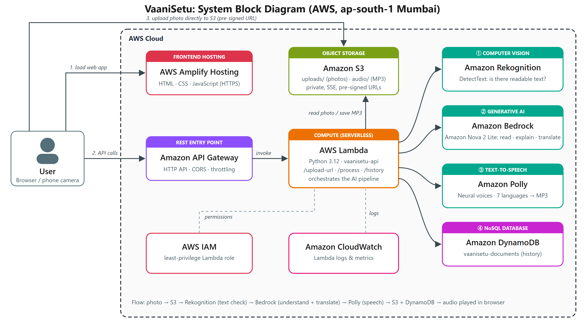

# VaaniSetu

**वाणी सेतु, "a bridge of voice".** Photograph any document (a prescription, bill, notice or form) and hear it explained in your language.

A serverless AWS application built for the Cloud Application Development (CAP 303) mini-project.

- **Live app:** https://main.dubqxztshiysh.amplifyapp.com
- **Report and slides:** [`deliverables/`](deliverables/)



## How it works

1. The browser gets a pre-signed URL from **API Gateway → Lambda** and uploads the photo straight to a private **S3** bucket.
2. **Amazon Rekognition** (DetectText) checks that the photo contains readable text.
3. **Amazon Nova 2 Lite on Amazon Bedrock** transcribes the document and writes a plain-language explanation, key points and action items in the chosen language.
4. **Amazon Polly** speaks the explanation with a neural voice. The MP3 is stored in S3.
5. The result is saved to **DynamoDB** and shown in the history.

Frontend hosting: **AWS Amplify Hosting**. Security: **IAM** least-privilege role. Monitoring: **CloudWatch**.

Output languages: English, Hindi, Spanish, French, German, Japanese and Arabic.

## Repository layout

| Path | Contents |
|---|---|
| `backend/lambda_function.py` | Lambda handler: `/upload-url`, `/process`, `/history` |
| `frontend/` | Static web app (HTML, CSS, JS) and sample documents |
| `infra/deploy.sh` | Provisions and deploys everything with the AWS CLI |
| `infra/lambda-policy.json` | Least-privilege IAM policy for the Lambda role |
| `infra/make_samples.py`, `infra/bill.html` | Generate the fictional sample documents |
| `report/` | Block diagram, screenshots, and the report and slide builders |
| `deliverables/` | Final report (DOCX/PDF) and presentation (PPTX/PDF) |

## Deploy

Requirements: the AWS CLI v2, configured for an account with Bedrock access to `amazon.nova-2-lite`, plus Bash, Python 3 and curl.

```bash
bash infra/deploy.sh
```

The script is safe to re-run. It creates or updates the S3 bucket, DynamoDB table, IAM role, Lambda function, HTTP API and Amplify app in `ap-south-1`, then prints the site URL.

## Rebuild the report and slides

```bash
pip install python-docx
python report/build_report.py "<front-pages.docx>" deliverables/VaaniSetu_MiniProject_Report.docx
NODE_PATH=<dir with pptxgenjs, react, react-dom, react-icons, sharp> node report/build_deck.js deliverables/VaaniSetu_Presentation.pptx
```

The front-page template is the college's `Mini-Project Report Front Pages.doc`, saved as `.docx`.
